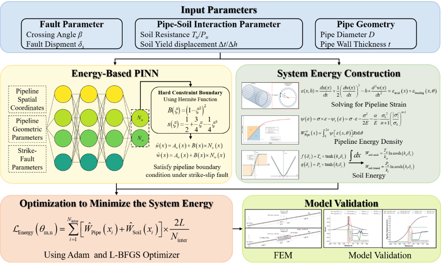
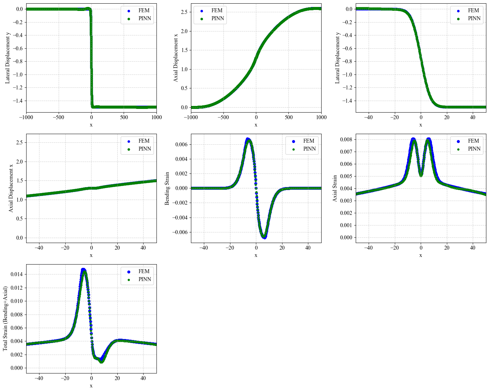

### Energy-based PINN for Buried Pipelines under Strike-Slip Faults

**🚀Contributor**

Fu Mengkai

China University of Petroleum (Beijing)//National Engineering Research  Center for Pipeline Safety//MOE Key Laboratory of Petroleum Engineering//Beijing Key Laboratory of Urban Oil and  Gas Distribution Technology

**🚀 Installation**

Prerequisites

Python 3.8+

PyTorch 2.0.1+

CUDA 11.8+ (recommended for GPU acceleration)

NumPy, Matplotlib

**🚀 Example**

import time

import torch

import numpy as np

import matplotlib.pyplot as plt

&#x20;

torch.set\_default\_dtype(torch.float)

device = torch.device('cuda:0' if torch.cuda.is\_available() else 'cpu')

torch.manual\_seed(42)

np.random.seed(42)

print(device)

D = 1.219         # 管径 m

t = 18.4          # 壁厚 m

fault\_disp =2    # 走滑断层位移 m

cross\_angle = 45  # 穿越角 度

disp\_grud\_x = fault\_disp \* np.cos(np.deg2rad(cross\_angle))

disp\_grud\_y = -fault\_disp \* np.sin(np.deg2rad(cross\_angle))

Tu = 41.86 \* 1000           # 轴向土弹簧极限抗力 N/m

Pu = 456 \* 1000          # 侧向土弹簧极限抗力 N/m

E = 207e9           # Pa

sigma\_y = 552e6     # Pa

H = (684e6 - 555e6) / (0.0485 - 555e6 / 207e9)  # 硬化模量 Pa

print('=' \* 30)

print('本计算案例基本条件为：')

print(f"管道几何条件为管径：{D} m，壁厚：{t} m")

print(f'断层位移条件为，x方向断层位移：{disp\_grud\_x} m，y方向断层位移：{disp\_grud\_y} m')

print(f'土弹簧条件为，轴向土弹簧极限抗力：{Tu} N/m，侧向土弹簧极限抗力：{Pu} N/m')

print(f'双线性管材参数为，弹性模量：{E} Pa，屈服应力：{sigma\_y} Pa，硬化模量：{H} Pa')

print('=' \* 30)

data = \[bc\_left.reshape(-1, 1),

&#x20;       bc\_right.reshape(-1, 1),

&#x20;       bc\_mid.reshape(-1, 1),

&#x20;       inter.reshape(-1, 1),

&#x20;       inter\_w.reshape(-1, 1)] 

backbone = PINN(layers=\[64, 128, 128, 64], max\_a=L).to(device)

model = HardConstraintPINN(

&#x20;   backbone, L=L,

&#x20;   disp\_grud\_x=disp\_grud\_x,

&#x20;   disp\_grud\_y=disp\_grud\_y,

).to(device)

trainer = Trainer(D, t, E, sigma\_y, H, disp\_grud\_x, disp\_grud\_y, Tu, Pu,

&#x20;                 ro\_n=12.6786, ro\_alpha=1.1156, ro\_sigma0=552e6,

&#x20;                 use\_data=False)

trainer.sharpness   = 10000.0

trainer.load\_factor = 1.0

trainer.pde\_form = 'energy'        # 关键：使用能量法

\# energy\_scale 留 None，trainer 会自动估算；想手动覆盖可:

\# trainer.energy\_scale = abs(Tu) \* 2 \* L \* abs(disp\_grud\_x)

\# trainer.energy\_scale = 1

&#x20;

t0 = time.time()

loss = trainer.train(

&#x20;   model, data, exp\_data=None,

&#x20;   adam\_epochs=20000,

&#x20;   use\_curriculum=False,

&#x20;   use\_lbfgs=False,

&#x20;   use\_adaptive\_weight=True,

&#x20;   use\_plot=True,

)

print(f'训练耗时 {time.time() - t0:.1f}s')

